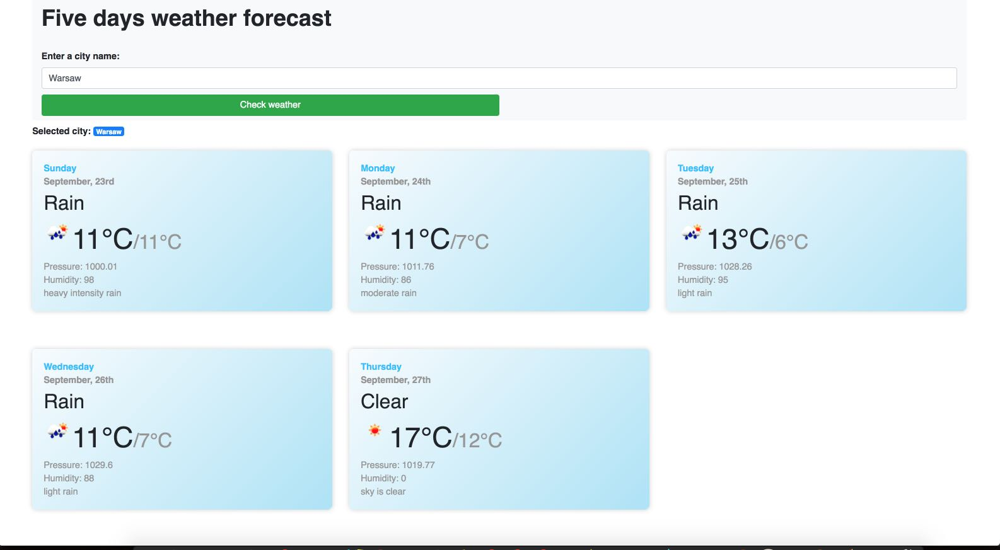

[](https://codecov.io/gh/michaelmoney/five-days-weather-forecast)

# Five days weather forecast app

**A simple web application that display five days forecast weather using OpenWeather API.
Built with HTML, React, Bootstrap 4 and Sass. App supports responsive web design.**

    



## Quick start

###  Pre-requirements

1. Make sure that you have node version >= `8.10.0`
2. Install `yarn` package manager globally. `npm` should work as well and it comes within node _out of the box_.
3. (Optionally) Docker.

###  Dependencies installation

Now you need to install all required dependencies using yarn/npm. Run following command:
```bash
npm install / yarn install
```

## Development

### Run application locally inside the browser:
To run application locally, simply run following command:
```bash
npm start / yarn start
```
If no errors, it will build and serve application which is accessible from the browser
under below url:
```
http://localhost:3000/
```

### Run eslint linter

To check if there are no JavaScript errors in the code, run:
```bash
npm run lint / yarn run lint
```

NOTE: Linter is triggerd with `--fix` flag, which allows auto fix most common errors / warnings.

Eslint extends `create-react-app` default rules as well as `eslint:recommended` rules with couple personal rules like indentation and force using semicolons and single-quotes.

### Run unit-tests

To run unit-test written using jest and enzyme, run in the terminal:
```bash
npm runt test / yarn run test
```

## Build app for the production
To build an application run:

```bash
npm run build / yarn run build
```

This will build application inside /build folder insider root project's folder.
Application can server using

### Run inside Docker

Dockerfile contains all needed configuration.

NOTE: First you need to install Docker globally.

1. To build Docker image, run in the reminal:

```bash
docker build . -t weather-app
```

2. To run Docer locally, run in the terminal

```bash
docker run -it -p 3001:80 weather-app
```

3. Now you can open a web browser and preview application:

```bash
http://localhost:3001/
```

## Tradeoffs & thoughts

1. To speed-up development process I've used ready-to-go `create-react-app` boilerplate as well as `Bootstrap` library to achieve responsive web design. Project could be done using HTML, jQuery / natvie JS, but it would be more painfull.

2. Project contains only couple unit-tests, however those tests cover class methods testing using `jest` framework and DOM testing using `enzyme`. More test could be written though. Tests files are located inside `/src` folder with `*.test.js` extension.

3. Instead of using `axios` library, native JS `fetch()` could be used for HTTP requests to achieve smaller bundle size.

4. Visual design of the app could be done better and more appealing (with more time)

5. Error handling is very basic.

6. There's no validation for city input.

7. User cannot change metrics (Fahrenheit / Celsius)

8. No locale / language support.


#### Selected libraries, frameworks and dependencies:

**Bootstrap 4** - brings responsive grid and styled UI components

**Eslint** - used for JavaScript static code analysis.

**create-react-app** - used to scaffold project with Webpack configuration "under the hood"

**jest** - testing framework used for wrtiting unit-tests

**Enzyme** - testing framw work used writing unit-test, especially for DOM testing.

**node-sass-chokidar** - together with "npm-run-all" allows to convert SCSS files into CSS files. It's needed due to the limitation of "create-react-app" project.

**axios** - a small library for handling Http requests. Used for easier scale-up project if needed. Although native JavaScript `fetch()` method could be used instead.

**moment.js** - small libary for date & time manipulation when displaying weather forecast.

**Docker** - used to run application inside container via Docker image. Allows easy application deplyoment in the cloud services (AWS / Heroku etc.)

## Links
- https://momentjs.com/
- https://github.com/facebook/create-react-app
- https://github.com/airbnb/enzyme
- https://reactjs.org/
- https://jestjs.io